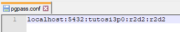
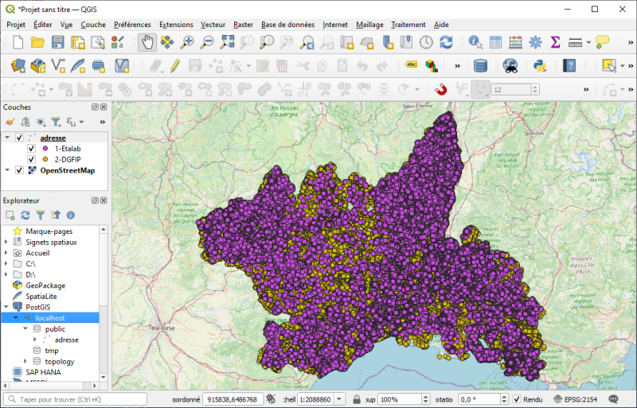

# Tutoriel : Prendre en main l’API PowerShell SI3P0.

Ce tutoriel montre comment l’API PowerShell SI3P0 peut permettre l’automatisation de traitements de données en lien avec un SIg construit sur PostgreSQL/Postgis.

Il est illustré par un cas pratique de téléchargement, d’import et d’exploitation des données de la Base Adresse Nationale.

_NDLR : Le terme API est peut-être mal choisi, le mot "toolkox" serait probablement plus adapté. Vu le nombre de références au dossier qui porte ce nom dans le code, j’avoue être faiblement motivé par l’idée de le renommer._

**Pré-requis :**

* Se dire que PowerShell, c’est comme tout, ça s’apprend.
* Avoir un SIg basé sur le couple PostgreSQL/Postgis.
* Avoir un client Windows qui :
    * permet la création et l’exécution de scripts PowerShell,
    * dispose des outils clients PostgreSQL/Postgis (dont principalement psql.exe),
    * dispose de ogr2ogr.exe.

**Table des matières**

[1. SI3Pquoi ?](#_1)

[2. Pourquoi une boîte à outils ?](#_2)

&nbsp;&nbsp;&nbsp;&nbsp;[2.1. "Donnez-moi un T !"](#_21)

&nbsp;&nbsp;&nbsp;&nbsp;[2.2. "Donnez- moi un E ! Donnez-moi un L !"](#_22)

&nbsp;&nbsp;&nbsp;&nbsp;[2.3. ELT et TEL](#_23)

&nbsp;&nbsp;&nbsp;&nbsp;[2.4. Quelques mots sur PowerShell](#_24)

[3. API SI3P0 et BAN](#_3)

&nbsp;&nbsp;&nbsp;&nbsp;[3.1. Etape 1 - Préparer le contexte de travail](#_31)

&nbsp;&nbsp;&nbsp;&nbsp;&nbsp;&nbsp;&nbsp;&nbsp;[3.1.1. Récupérer l’API SI3P0](#_311)

&nbsp;&nbsp;&nbsp;&nbsp;&nbsp;&nbsp;&nbsp;&nbsp;[3.1.2. (Facultatif) Installer 7-Zip](#_312)

&nbsp;&nbsp;&nbsp;&nbsp;&nbsp;&nbsp;&nbsp;&nbsp;[3.1.3. Créer une base de tests](#_313)

&nbsp;&nbsp;&nbsp;&nbsp;&nbsp;&nbsp;&nbsp;&nbsp;[3.1.4. Ajouter les informations de connexion au PGPASS](#_314)

&nbsp;&nbsp;&nbsp;&nbsp;&nbsp;&nbsp;&nbsp;&nbsp;[3.1.5. Modifier le fichier constantes.ps1](#_315)

&nbsp;&nbsp;&nbsp;&nbsp;&nbsp;&nbsp;&nbsp;&nbsp;[3.1.6. Modifier le fichier sig_défaut.ps1](#_316)

&nbsp;&nbsp;&nbsp;&nbsp;&nbsp;&nbsp;&nbsp;&nbsp;[3.1.7. (Facultatif) Nettoyer le code spécifique au Gard](#_317)

&nbsp;&nbsp;&nbsp;&nbsp;&nbsp;&nbsp;&nbsp;&nbsp;[3.1.8. Fixer l’ExecutionPolicy](#_318)

&nbsp;&nbsp;&nbsp;&nbsp;&nbsp;&nbsp;&nbsp;&nbsp;[3.1.9. Jouer les Tests Unitaires (TU)](#_319)

&nbsp;&nbsp;&nbsp;&nbsp;[3.2. Etape 2 - Explorer l’API](#_32)

&nbsp;&nbsp;&nbsp;&nbsp;[3.3. Etape 3 - Phase Extract : Télécharger les données de la BAN](#_33)

&nbsp;&nbsp;&nbsp;&nbsp;&nbsp;&nbsp;&nbsp;&nbsp;[3.3.1. Principe](#_331)

&nbsp;&nbsp;&nbsp;&nbsp;&nbsp;&nbsp;&nbsp;&nbsp;[3.3.2. Script](#_332)

&nbsp;&nbsp;&nbsp;&nbsp;&nbsp;&nbsp;&nbsp;&nbsp;[3.3.3. Exécution du script](#_333)

&nbsp;&nbsp;&nbsp;&nbsp;[3.4. Etape 4 - Phase Load : Importer les données BAN dans le SIg](#_34)

&nbsp;&nbsp;&nbsp;&nbsp;&nbsp;&nbsp;&nbsp;&nbsp;[3.4.1. Principe](#_341)

&nbsp;&nbsp;&nbsp;&nbsp;&nbsp;&nbsp;&nbsp;&nbsp;[3.4.2. Script](#_342)

&nbsp;&nbsp;&nbsp;&nbsp;&nbsp;&nbsp;&nbsp;&nbsp;[3.4.3. Exécution du script](#_343)

&nbsp;&nbsp;&nbsp;&nbsp;[3.5. Etape 5 - Phase Transform : Créer/peupler la structure de données](#_35)

&nbsp;&nbsp;&nbsp;&nbsp;&nbsp;&nbsp;&nbsp;&nbsp;[3.5.1. Principe](#_351)

&nbsp;&nbsp;&nbsp;&nbsp;&nbsp;&nbsp;&nbsp;&nbsp;[3.5.2. Création de la table cible](#_352)

&nbsp;&nbsp;&nbsp;&nbsp;&nbsp;&nbsp;&nbsp;&nbsp;[3.5.3. Script](#_353)

&nbsp;&nbsp;&nbsp;&nbsp;&nbsp;&nbsp;&nbsp;&nbsp;[3.5.4. Exécution du script](#_354)

&nbsp;&nbsp;&nbsp;&nbsp;[3.6. Etape 6 - Géocoder des adresses et exporter le résultat](#_36)

&nbsp;&nbsp;&nbsp;&nbsp;&nbsp;&nbsp;&nbsp;&nbsp;[3.6.1. Principe](#_361)

&nbsp;&nbsp;&nbsp;&nbsp;&nbsp;&nbsp;&nbsp;&nbsp;[3.6.2. Création des fonctions de géocodage](#_362)

&nbsp;&nbsp;&nbsp;&nbsp;&nbsp;&nbsp;&nbsp;&nbsp;[3.6.3. Aperçu](#_363)

&nbsp;&nbsp;&nbsp;&nbsp;&nbsp;&nbsp;&nbsp;&nbsp;[3.6.4. Script](#_364)

&nbsp;&nbsp;&nbsp;&nbsp;&nbsp;&nbsp;&nbsp;&nbsp;[3.6.5. Exécution du script](#_365)

[4. Conclusion](#_4)

## <a name="_1"></a>1. SI3Pquoi ?

SI3P0 pour Systèmes d’Information 3.0 ; c’est le nom donné au SIg que nous développons à la Mission des Systèmes d’Information (MSI) pour la direction "routes et bâtiments" du Gard. Il fait référence au logo de la collectivité et au code INSEE de notre [chauvin=’on’]magnifique département[chauvin=’off’].

## <a name="_2"></a>2. Pourquoi une boîte à outils ?

Classiquement, un SIg se construit autour de 3 briques :
* un Système de Gestion de Bases de Données géographiques (SGBDg),
* des outils de visualisation,
* un logiciel d’extraction, de transformation et de chargement des données (ETL).


Lorsque les moyens financiers manquent, difficile de faire l’impasse sur le SGBDg et les outils de visualisation. Mais PostgreSQL/Postgis et QGis font très bien le job.

L’ETL est quant à lui remplacé par une brique moins onéreuse ; classiquement appelée le "Shadok".
Le "Shadok" c’est quoi ? Et bien le "Shadok" c’est toi ;
* Toi qui télécharges tous les mois la dernière mise à jour des données avec ton navigateur favori.
* Toi qui fais "clic-droit > extraire vers" pour décompresser une à une les 42 archives fraîchement téléchargées.
* Toi qui enfin importes les données dans la base avec des outils graphiques type "Postgis Shapefile Import/Export Manager".


A la MSI nous n’avons pas de budget alloué et notre équipe se compte sur les doigts d’une demi-main. Mais, comme tout bon informaticien qui se respecte...on est feignant !

### <a name="_21"></a>2.1. "Donnez-moi un T !"

L’ETL transforme. Tu peux grâce à lui croiser, filtrer, grouper, sélectionner, adapter (et plein d’autres verbes à l’infinitif) tes données. Mais ceux qui suivent auront noté que dans SGBGg il y a "Gestion" et "Données". Aussi, il est tout à fait possible de faire faire les transformations au serveur de bases. Le SGBDg n’est plus seulement vu comme la brique de stockage mais aussi comme serveur de (géo)traitements.

Ce principe selon lequel le "code" est placé au niveau du SGBD porte le nom de base épaisse. Ce n’est pas l’objet du tutoriel aussi je t’invite à [lire le "Plaidoyer de Frédéric Brouard" pour en savoir plus](https://www.yumpu.com/fr/document/read/51018012/plaidoyer-de-frederic-brouard-sur-le-concept-de-bases-de-donnees-epaisses){:target="_blank"}. 

### <a name="_22"></a>2.2. "Donnez- moi un E ! Donnez-moi un L !"

En revanche, le SGBD n’est pas l’outil le plus adapté pour interagir avec le système de fichiers même si certaines choses sont possibles ; `foreign data`, `copy from file`. Et surtout le SGBD n’ira pas récupérer la matière sur le net pour toi.

C’est là qu’intervient l’API. Celle-ci propose notamment des fonctions :
* de téléchargement,
* de manipulation d’archives dont certaines avec l’appui de 7-Zip,
* d’import-export de (géo)données via psql et ogr2ogr.

Elle donne également la possibilité de paralléliser les traitements grâce à ce que nous appelons des "jobs" qui lancent simultanément plusieurs processus. Il est ainsi possible d’exploiter au mieux les ressources machines et par conséquent de réduire les temps de traitement.

### <a name="_23"></a>2.3. ELT et TEL

Puisqu’il est question de transformer les données grâce aux SGBDg, l’approche sera légèrement différente du classique schéma ETL.

En entrée, il faudra charger les données "au plus tôt" dans la base pour pouvoir les adapter au modèle cible ; ELT pour Extract Load Transform.

En sortie, il faudra extraire les données "au plus tard" après qu’elles aient été rendues compatibles avec le format attendu ; TEL pour Transform Extract Load.


### <a name="_24"></a>2.4. Quelques mots sur PowerShell

PowerShell est à Windows ce que Bash est à Linux. Au placard donc les .BAT, c’est l’heure de faire des .PS1.

Ce langage de script propose de nombreuses cmdlet (prononcer commandlette) pour réaliser différentes opérations allant du simple `Write-Host`, pour écrire sur la sortie standard, au `Invoke-WebRequest` et ses multiples paramètres pour envoyer une requête HTTP/HTTPS.

Si malgré tout, tu ne trouves pas la cmdlet qu’il te faut, tu pourras créer tes propres fonctions et profiter de la richesse du Framework .NET sur lequel PowerShell s’appuie.

Comme PowerShell est inclus à Windows, même si tu n’as pas de droits administrateurs dans ton contexte professionnel, il est probable que tu ais accès à :
* Windows PowerShell (powershell.exe) : l’interface ligne de commande,
* Windows PowerShell ISE (powershell_ise.exe) : un éditeur de scripts simple mais complet puisqu’il permet l’exécution pas à pas et le debug.


## <a name="_3"></a>3. API SI3P0 et BAN

L’API Adresse disponible sur Etalab propose la point d’entrée `/search/` pour le géocodage. Lorsque le numéro est introuvable, un point au centre de la rue (type street) est retourné.

Dans notre cas, si le numéro est absent, nous souhaitons que le numéro le plus proche soit retourné. Nous avons pour cela automatisé le téléchargement et l’import des données de la BAN dans le SIg et avons développé une fonction PL/pgSQL de géocodage. Celle-ci est moins souple/puissante que la version Etalab et ne se base que sur les adresses présentent dans le SIg, mais elle est suffisante pour nos besoins.

Le tutoriel qui suit s’appuie sur ce cas d’usage.

### <a name="_31"></a>3.1. Etape 1 - Préparer le contexte de travail

_"Nombreuses les étapes préparatoires sont, de patience t’armer tu dois"_. Il y a effectivement plusieurs choses à faire préalablement à l’utilisation de l’API. J’ai essayé de détailler ici les différents "level" à passer pour que tu sois ensuite opérationnel pour la rédaction de scripts PowerShell, c’est donc un peu verbeux mais pas forcément très long.

#### <a name="_311"></a>3.1.1. Récupérer l’API SI3P0

L’API SI3P0, ainsi que le code propre à certains de nos cas d’usages, sont disponibles sous licence BSD-3 à l’emplacement suivant : [https://github.com/CD30-Devil/SI3P0](https://github.com/CD30-Devil/SI3P0){:target="_blank"}

Le sous-dossier API est suffisant mais les autres répertoires peuvent à minima servir d’exemple voire être réutilisables moyennant quelques adaptations (notamment pour les collègues territoriaux qui travaillent sur des thématiques équivalentes aux nôtres).

Commence donc par récupérer ce "repo" par téléchargement et extraction du Zip ou en créant un fork du projet.

#### <a name="_312"></a>3.1.2. (Facultatif) Installer 7-Zip

7-Zip est un logiciel libre et gratuit de gestion des fichiers archives. Après installation, tu auras accès à deux versions de l’outil :
* une version graphique ; pratique au quotidien,
* une version ligne de commande ; que tu pourras appeler via l’API SI3P0.

Si tu n’es pas en mesure d’installer 7-Zip, l’API propose des fonctions natives pour les fichiers Zip et GZip...ce qui reste malgré tout assez limité.

#### <a name="_313"></a>3.1.3. Créer une base de tests

Pour les premiers tests, je t’encourage à créer une base dédiée histoire de te familiariser avec les différentes fonctions avant de travailler sur ta base de production.

Je recommande également de créer dans cette base (et ensuite dans la base de production) un schéma de travail pour la création des tables, vues et fonctions temporaires nécessaires aux transformations.

Comme il faut ajouter des extensions à cette base, il te faudra être connecté en tant que superuser.

```sql
-- création d'un utilisateur
create role r2d2 with password 'r2d2' login nosuperuser createdb;

-- création de la base de données de test
create database tutosi3p0 owner r2d2;

-- connexion à la base tutosi3p0
\c tutosi3p0

-- installation des extensions PostGis
create extension if not exists postgis;
create extension if not exists postgis_topology;

-- installation de l'extension unaccent (pour disposer de la fonction du même nom)
-- cf. https://www.postgresql.org/docs/13/unaccent.html
create extension if not exists unaccent;

-- création de l'extension pg_trgm (pour disposer de la fonction similarity)
-- https://www.postgresql.org/docs/13/pgtrgm.html
create extension if not exists pg_trgm;

-- création du schéma temporaire
create schema tmp authorization r2d2;
```


#### <a name="_314"></a>3.1.4. Ajouter les informations de connexion au PGPASS

L’API SI3P0 utilise le fichier PGPASS (notamment via psql.exe) pour se connecter au serveur PostgreSQL. Il te faut donc y ajouter les paramètres de connexion à la base nouvellement créée. Tu trouveras plus d’information sur ce fichier ici : [https://docs.postgresql.fr/13/libpq-pgpass.html](https://docs.postgresql.fr/13/libpq-pgpass.html){:target="_blank"}



#### <a name="_315"></a>3.1.5. Modifier le fichier constantes.ps1

Le fichier API\PowerShell\constantes.ps1 fixe plusieurs paramètres utiles à l’API. Il est notamment question de définir les chemins vers les outils PostgreSQL et OSGeo4W.

Après ouverture de ce fichier dans Windows PowerShell ISE, tu dois modifier les éléments placés entre chevrons :

* `&racinePostgreSQL` et `&racineOSGeo4W` : Ces racines sont utilisées dans les constantes qui suivent, aussi, si ton contexte de travail le nécessite, tu peux également modifier les chemins dans la suite du fichier pour pointer vers les bons emplacements des différents outils.

* `$racineOracle` : Tu n’as pas de client Oracle sur ton poste ? Pas de panique. En fait, ce chemin sert seulement si tu dois extraire des données depuis une base Oracle. Tu peux donc le laisser tel quel si ce n’est pas ton cas.

* `$email_contact` et `$serveurSMTP` : Ces variables sont utiles si tu veux envoyer des mails depuis tes scripts. Dans le cas contraire, tu peux passer ton chemin. A noter qu’en l’état, l’API ne gère que le SMTP sans authentification.

Tu peux en profiter pour modifier le chemin vers le dossier de travail temporaire (`$dossierTravailTemp`) qu’utilisent plusieurs fonctions. Tu pourras aussi changer le SRID par défaut (`$sridDefaut`) mais pour les besoins du tuto il te faut rester pour le moment en 2154.


#### <a name="_316"></a>3.1.6. Modifier le fichier sig_défaut.ps1

Le fichier API\PowerShell\sig_défaut.ps1 est un élément central de l’API SI3P0. Il contient les fonctions d’interaction avec le SGBDg.

Les paramètres de connexion à la base SIg sont à définir en haut de ce fichier. Ceux-ci sont ensuite passés comme valeur par défaut aux arguments des fonctions. Il reste possible d’outrepasser ces paramètres lors des appels ce qui peut par exemple être utile ;
* lorsque plusieurs bases sont exploitées (test et production),
* quand des utilisateurs avec des droits distincts sont nécessaires pour la connexion à la base.

Tu trouveras également dans ce fichier la variable `$sigNbCoeurs` qui détermine le nombre de cœurs du SGBDg. Celle-ci peut permettre de limiter le nombre de processus en parallèle lors de l’utilisation des jobs.


#### <a name="_317"></a>3.1.7. (Facultatif) Nettoyer le code spécifique au Gard

Certains fichiers sont spécifiques aux besoins et à l’infrastructure du Département du Gard. Tu peux supprimer ce code qui est là pour garder la cohérence avec le source des autres dossiers du "repo".

Pour cela :
* supprime le fichier API\PowerShell\constantes_si3p0.ps1,
* supprime le fichier API\PowerShell\fonctions_si3p0.ps1,
* supprime le fichier API\PowerShell\jobs_si3p0.ps1,
* dans le fichier API\PowerShell\api_complète.ps1, retire l’appel aux 3 fichiers spécifiques.

#### <a name="_318"></a>3.1.8. Fixer l’ExecutionPolicy

Si tu veux tout savoir sur l’ExecutionPolicy c’est par là :

[https://docs.microsoft.com/fr-fr/powershell/module/microsoft.powershell.core/about/about_execution_policies?view=powershell-7.1](https://docs.microsoft.com/fr-fr/powershell/module/microsoft.powershell.core/about/about_execution_policies?view=powershell-7.1){:target="_blank"}

Mais si tu n’es pas motivé pour lire tout ça et bien, en résumé, tu dois savoir que l’ExecutionPolicy est un niveau de sécurité appliqué à l’exécution des scripts PowerShell. Par défaut, cela empêche le lancement de scripts non signés numériquement. Pour cette raison, le niveau de sécurité doit être abaissé pour permettre l’utilisation de l’API SI3P0.

L’ExecutionPolicy peut se fixer au niveau machine mais cela nécessite des droits administrateur. Pour ce faire, exécute Windows PowerShell en tant qu’administrateur et lance la commande suivante :

`Set-ExecutionPolicy -scope LocalMachine Unrestricted`

Si tu n’es pas administrateur, tu peux également modifier ce paramètre au niveau utilisateur. Dans ce cas il te faut lancer la commande suivante :

`Set-ExecutionPolicy -scope CurrentUser Unrestricted`

Si tu penses lancer des scripts dans des contextes 64 bits et 32 bits alors tu dois également exécuter ces commandes avec la version x86 de Windows PowerShell.

Si tu n'es pas en mesure de faire l’un ou l’autre, il reste deux options qui ne sont pas très pratiques puisqu’il est question de fixer le niveau à la session. Il faudra donc refaire l’action à chaque exécution.

* Option 1 - Passer le paramètre au lancement de Windows Powershell grâce à la commande suivante : `powershell.exe -executionpolicy Unrestricted`

* Option 2 - Fixer la variable d’environnement `PSExecutionPolicyPreference` pour la session, il suffit pour cela de lancer dans l’invite PowerShell la commande suivante : `$Env:PSExecutionPolicyPreference = 'Unrestricted'`

#### <a name="_319"></a>3.1.9. Jouer les Tests Unitaires (TU)

C’est le moment de voir si ça fonctionne. En lançant les tests unitaires, tu pourras voir ce qui est vert et OK ou rouge et non utilisable.

Attention, certains tests créent et suppriment des tables et vues dans la base SIg par défaut. Si tu dois les lancer sur une base de production, il est peu probable qu’une table ou vue porte le même nom que ceux choisis pour les tests (`table_tu_sig_defaut`, `vue_tu_sig_defaut`) mais il vaut mieux rester vigilant.

Pour exécuter les tests, ouvre le fichier API\TU\PowerShell\exécuter.ps1 avec Windows PowerShell ISE et lance l’exécution (touche F5).


Ici, plusieurs tests sont KO comme ceux qui concernent les fonctions 7-Zip, ce dernier n’étant pas installé sur le poste. Mais de nombreux tests sont au vert dont notamment ceux sur les fonctions d’interaction avec le SIg.

En l’état, rien ne nous empêche de continuer le tuto en utilisant uniquement les parties opérationnelles. Charge à toi de régler ce qui cloche dans ton contexte de travail pour que tout soit OK afin de bénéficier pleinement de l’API.

### <a name="_32"></a>3.2. Etape 2 - Explorer l’API

Le résultat des TU que tu viens de jouer te donne un petit aperçu des fonctions proposées. Cela dit, cela peut-être le bon moment pour regarder d’un peu plus près ce qu’il y a sous le capot. Tu trouveras ci-dessous un bref descriptif de chaque fichier.

**api_complète.ps1**

Ce fichier référence l’ensemble des autres scripts de l’API. Il te suffira de l’inclure à ton code pour pouvoir utiliser les différentes fonctions.

**constantes.ps1**

Comme tu as pu le voir précédemment, on trouve là plusieurs constantes utiles à l’API.

**fonctions_archives.ps1**

Dans ce fichier se trouvent les fonctions de manipulation des archives Zip, GZip ainsi que les fonctions d’appel à 7-Zip.

**fonctions_es.ps1**

Pour l’instant, il n’y a là qu’une fonction pour changer l’encodage d’un fichier.

**fonctions_excel.ps1**

Excel ? Mais si tu vois, le tableur de Microsoft. Ce fichier propose deux fonctions de conversion de XLS/XLSX en CSV, une qui s'appuie sur Excel via du pilotage OleAutomation et une autre qui utilise un driver OleDB.

**fonctions_géodonnées.ps1**

Ce script propose des fonctions d’exécution d’ogr2ogr, shp2pgsql et raster2pgsql.

**fonctions_jobs**

Les jobs permettent l’exécution en parallèle de plusieurs processus. La fonction de lancement des jobs se trouve ici.

**fonctions_oracle.ps1**

Pour interagir avec des bases Oracle, tu pourrais avoir besoin des fonctions de lancement de SQLPlus et d’export du résultat d’une requête Oracle en CSV que propose ce fichier.

**fonctions_outils.ps1**

Tout ce qui est inclassable.

**fonctions_postgis.ps1**

Pratique pour l’import/export de GeoJSON et SHP vers/depuis une base PostgreSQL/Postgis. Les fonctions utilisent ogr2ogr.

**fonctions_postgresql.ps1**

Et bien je crois que c’est clair non ? Tu trouveras dans ce fichier ce qu’il faut pour exploiter une base PostgreSQL.

**fonctions_web.ps1**

Pour télécharger un fichier ou envoyer un e-mail, c’est par là que ça se passe.

**jobs_postgis.ps1**

C’est comme fonctions_postgis mais en version jobs.

**jobs_postgresql.ps1**

C’est comme fonctions_postgresql mais en version jobs.

**jobs_web.ps1**

Il faut vraiment que je la fasse une troisième fois ?

**sig_défaut.ps1**

Ce fichier agrège les fonctions et jobs PostgreSQL/Postgis pour les reproposer en ciblant par défaut la base paramétrée à l’étape 3.1.6.

### <a name="_33"></a>3.3. Etape 3 - Phase Extract : Télécharger les données de la BAN

#### <a name="_331"></a>3.3.1. Principe

Avec ce script, tu vas télécharger les fichiers BAN version Etalab et DGFIP de plusieurs départements. Pour cela, tu vas paramétrer un job de téléchargement pour chaque fichier puis lancer ces jobs.

#### <a name="_332"></a>3.3.2. Script

Dans Windows PowerShell ISE, rédige puis lance le script suivant. Il te faut l’enregistrer dans un dossier à côté du dossier API ou adapter les chemins (notamment l’import du fichier api_complète.ps1) pour pouvoir l’exécuter. Tu peux modifier la liste des départements si tu le souhaites.

```powershell
# on importe l'API SI3P0
# la constante $PSScriptRoot permet de définir le chemin relativement au script courant
. ("$PSScriptRoot\..\API\PowerShell\api_complète.ps1")
 
# on crée une variable pour fixer le chemin de téléchargement des fichiers
$dossierDonnees = "$PSScriptRoot\Données"
 
# on crée un tableau des numéros de départements à télécharger
$departements = @( '07', '12', '13', '30', '34', '48', '84' )
 
# on crée un ArrayList (tableau dynamique) que l'on va remplir avec le paramétrage des jobs de téléchargement
$parametresJobs = [System.Collections.ArrayList]::new()
 
# on itère sur le tableau des départements pour créer le paramétrage des jobs correspondants
foreach ($departement in $departements) {
 
    # la fonction Parametrer-Job-Telecharger est issue du fichier jobs_web.ps1
    # elle prend 2 paramètres : l'URL de téléchargement et la cible de l'enregistrement
    # l'objet résultat de l'appel à Parametrer-Job-Telecharger est ajouté à l'ArrayList
    
    # premier ajout, le fichier Etalab du département
    [void]$parametresJobs.Add((Parametrer-Job-Telecharger `
        -url "https://adresse.data.gouv.fr/data/ban/adresses/latest/csv/adresses-$departement.csv.gz" `
        -enregistrerSous "$dossierDonnees\$departement-etalab.csv.gz"))
 
    # second ajout, le fichier DGFIP du département
    [void]$parametresJobs.Add((Parametrer-Job-Telecharger `
        -url "https://adresse.data.gouv.fr/data/adresses-cadastre/latest/csv/adresses-cadastre-$departement.csv.gz" `
        -enregistrerSous "$dossierDonnees\$departement-dgfip.csv.gz"))
}

# lorsque le paramétrage est terminé,
# on exécute les jobs grâce à la fonction Executer-Jobs présente dans fonctions_jobs.ps1
# par défaut, le nombre de jobs en parallèle est égal au nombre de coeurs de la machine - 1
Executer-Jobs -parametresJobs $parametresJobs 
```

#### <a name="_333"></a>3.3.3. Exécution du script

Le script lance en parallèle un nombre de processus égal au nombre de cœurs de ta machine moins un (dans mon cas 8 - 1 = 7). Tu peux voir ça grâce à ProcessExplorer.


A l’issue de l’exécution, tu dois avoir à l’emplacement de téléchargement choisi, deux fichiers .gz par département.


### <a name="_34"></a>3.4. Etape 4 - Phase Load : Importer les données BAN dans le SIg

#### <a name="_341"></a>3.4.1. Principe

Pour la phase Load, il va être question de décompresser et d’importer les fichiers précédemment téléchargés dans deux tables temporaires, une Etalab et une DGFIP. Celles-ci auront la même structure que les fichiers CSV et seront formées uniquement de colonnes de type TEXT.

#### <a name="_342"></a>3.4.2. Script

Toujours dans Windows PowerShell ISE, copie-colle le code source ci-dessous dans un nouveau script et sauvegarde le à côté du précédent. Ensuite, lance le grâce à la touche F5.

```powershell
# on importe l'API SI3P0
. ("$PSScriptRoot\..\API\PowerShell\api_complète.ps1")
 
# on crée une variable pour définir le chemin source des fichiers
$dossierDonnees = "$PSScriptRoot\Données"
 
# on crée une variable pour fixer un dossier de sortie des rapports
$dossierRapports = "$PSScriptRoot\Rapports\Load"
 
# on réalise un nettoyage préalable en début de script
# effacement des rapports
Remove-Item "$dossierRapports\*.txt"
Remove-Item "$dossierRapports\*.err"
 
# effacement des fichiers temporaires
Remove-Item "$dossierTravailTemp\tuto_si3p0\Load\*" -Recurse -Force
 
# effacement des tables temporaires
SIg-Effacer-Table -table 'tmp.AdresseEtalab' `
    -sortie "$dossierRapports\$(Get-Date -Format 'yyyy-MM-dd HH-mm-ss') - effacement tmp.AdresseEtalab.txt"
 
SIg-Effacer-Table -table 'tmp.AdresseDGFIP' `
    -sortie "$dossierRapports\$(Get-Date -Format 'yyyy-MM-dd HH-mm-ss') - effacement tmp.AdresseDGFIP.txt"
 
# on itère sur les fichiers .gz pour les décompresser dans le dossier de travail temporaire défini dans constantes.ps1
foreach ($gz in (Get-ChildItem "$dossierDonnees\*.gz")) {
    DeGZipper -archive $gz -extraireVers "$dossierTravailTemp\tuto_si3p0\Load\"
}
 
# on crée les 2 tables temporaires pour l'import des CSV
# grâce à la fonction SIg-Creer-Table-Temp présente dans sig_défaut.ps1
# elle prend 2 paramètres obligatoires : le nom (+ facultatif le schéma) de la table et la liste de ses colonnes
# le paramètre sortie est facultatif,
# il permet de récupérer la sortie standard et erreur de psql qui est lancé par la fonction
SIg-Creer-Table-Temp `
    -table 'tmp.AdresseEtalab' `
    -colonnes `
        'id', `
        'id_fantoir', `
        'numero', `
        'rep', `
        'nom_voie', `
        'code_postal', `
        'code_insee', `
        'nom_commune', `
        'code_insee_ancienne_commune', `
        'nom_ancienne_commune', `
        'x', `
        'y', `
        'lon', `
        'lat', `
        'alias', `
         'nom_ld', `
         'libelle_acheminement', `
         'nom_afnor', `
         'source_position', `
         'source_nom_voie' `
    -sortie "$dossierRapports\$(Get-Date -Format 'yyyy-MM-dd HH-mm-ss') - création tmp.AdresseEtalab.txt"
 
SIg-Creer-Table-Temp `
    -table 'tmp.AdresseDGFIP' `
    -colonnes `
        'cle_interop', `
        'uid_adresse', `
        'numero', `
        'suffixe', `
        'pseudo_numero', `
        'voie_nom', `
        'voie_code', `
        'code_postal', `
        'libelle_acheminement', `
        'destination_principale', `
        'commune_code', `
        'commune_nom', `
        'source', `
        'long', `
        'lat', `
        'x', `
        'y', `
        'position', `
        'date_der_maj' `
    -sortie "$dossierRapports\$(Get-Date -Format 'yyyy-MM-dd HH-mm-ss') - création tmp.AdresseDGFIP.txt"
 
# on crée un ArrayList (tableau dynamique) que l'on va remplir avec le paramétrage des jobs d'import
$parametresJobs = [System.Collections.ArrayList]::new()
 
foreach ($csvEtalab in (Get-ChildItem "$dossierTravailTemp\tuto_si3p0\Load\*-etalab.csv")) {
    # la fonction Parametrer-Job-SIG-Importer-CSV est également issue du fichier sig_défaut.ps1
    # elle prend 2 paramètres obligatoires : la table cible et le CSV à importer
    [void]$parametresJobs.Add((Parametrer-Job-SIG-Importer-CSV -table 'tmp.AdresseEtalab' -csv $csvEtalab))
}
 
foreach ($csvDGFIP in (Get-ChildItem "$dossierTravailTemp\tuto_si3p0\Load\*-dgfip.csv")) {
    [void]$parametresJobs.Add((Parametrer-Job-SIG-Importer-CSV -table 'tmp.AdresseDGFIP' -csv $csvDGFIP))
}
 
# on exécute les jobs en demandant de lancer un nombre de processus égal au nombre de coeurs du serveur / 2
Executer-Jobs -parametresJobs $parametresJobs -nombreJobs $($sigNbCoeurs / 2)
 
# on réalise un nettoyage en fin de script
Remove-Item "$dossierTravailTemp\tuto_si3p0\Load\*" -Recurse -Force
```

#### <a name="_343"></a>3.4.3. Exécution du script

Le script enchaîne plusieurs étapes : nettoyage préalable, extraction des archives, création de tables temporaires, import des données et nettoyage final.

Si tout se déroule correctement, tu dois avoir à la fin du script deux tables dans le schéma tmp de la base de tests. Celles-ci contiennent respectivement les lignes des CSV Etalab et DGFIP ; soit dans mon cas plus d’1,5 millions de lignes chacune.


### <a name="_35"></a>3.5. Etape 5 - Phase Transform : Créer/peupler la structure de données

#### <a name="_351"></a>3.5.1. Principe

Avec cette étape de transformation, tu vas peupler une unique table géographique par fusion des données des tables temporaires AdresseEtalab et AdresseDGFIP. Toutes les lignes de la première table seront exploitées alors que seules les adresses fictives seront récupérées depuis les données DGFIP.

#### <a name="_352"></a>3.5.2. Création de la table cible

Préalablement à la rédaction du script, tu dois créer la table cible des données. Puisqu’il s’agit d’une table définitive, celle-ci n’est pas créée dans le schéma tmp. Ci-dessous le script SQL de création.

```sql
create table adresse (
    idadresse            SERIAL not null,
    cogcommune           VARCHAR              not null,
    numero               INT4                 null,
    repetition           VARCHAR              null,
    nomvoie              VARCHAR              null,
    source               VARCHAR              null,
    idsource             VARCHAR              null,
    constraint pkadresse primary key (idadresse)
);

select AddGeometryColumn('adresse', 'geom', 2154, 'POINT', 2);
create index adresse_geom_idx on adresse using gist (geom);

create unique index adresse_pk on adresse (
    idadresse
);

create index adresse_commune_fk on adresse (
    cogcommune
);
```

#### <a name="_353"></a>3.5.3. Script

Le code du script de transformation qui suit est à sauvegarder dans un nouveau fichier .ps1 et à exécuter depuis Windows Powershell ISE.

```powershell
# on importe l'API SI3P0
. ("$PSScriptRoot\..\API\PowerShell\api_complète.ps1")
 
# on crée une variable pour fixer un dossier de sortie des rapports
$dossierRapports = "$PSScriptRoot\Rapports\Transform"
 
# on réalise un nettoyage préalable en début de script
# effacement des rapports
Remove-Item "$dossierRapports\*.txt"
Remove-Item "$dossierRapports\*.err"
 
# effacement des données de la table
SIg-Executer-Commande `
    -commande 'delete from Adresse;' `
    -sortie "$dossierRapports\$(Get-Date -Format 'yyyy-MM-dd HH-mm-ss') - raz Adresse.txt"
 
SIg-Executer-Commande `
    -commande "select pg_catalog.setval('adresse_idadresse_seq', 1, false);" `
    -sortie "$dossierRapports\$(Get-Date -Format 'yyyy-MM-dd HH-mm-ss') - raz séquence Adresse.txt"
 
# remplissage de la table Adresse
# la fonction SIg-Executer-Commande est présente dans le fichier sig_défaut.ps1
# elle prend un paramètre obligatoire commande correspondant au SQL à jouer
# le paramètre sortie est facultatif,
# il permet de récupérer la sortie standard et erreur de psql qui est lancé par la fonction
SIg-Executer-Commande `
    -sortie "$dossierRapports\$(Get-Date -Format 'yyyy-MM-dd HH-mm-ss') - remplissage Adresse.txt" `
    -commande @'
-- insertion des adresses Etalab
insert into Adresse (COGCommune, Numero, Repetition, NomVoie, Source, IdSource, Geom)
select
    code_insee,
    numero::integer,
    coalesce(rep, ''),
    nom_voie,
    '1-Etalab',
    id,
    ST_SetSRID(ST_MakePoint(x::numeric, y::numeric), 2154)
from tmp.AdresseEtalab;
 
-- insertion des adresses "fictives" DGFIP
insert into Adresse (COGCommune, Numero, Repetition, NomVoie, Source, IdSource, Geom)
select
    commune_code,
    numero::integer,
    coalesce(suffixe, ''),
    voie_nom,
    '2-DGFIP',
    cle_interop,
    ST_SetSRID(ST_MakePoint(x::numeric, y::numeric), 2154)
from tmp.AdresseDGFIP
where pseudo_numero = 'true';
'@
 
# on réalise un nettoyage en fin de script
# effacement des tables temporaires
SIg-Effacer-Table -table 'tmp.AdresseEtalab' `
    -sortie "$dossierRapports\$(Get-Date -Format 'yyyy-MM-dd HH-mm-ss') - effacement tmp.AdresseEtalab.txt"
 
SIg-Effacer-Table -table 'tmp.AdresseDGFIP' `
    -sortie "$dossierRapports\$(Get-Date -Format 'yyyy-MM-dd HH-mm-ss') - effacement tmp.AdresseDGFIP.txt"
```

#### <a name="_354"></a>3.5.4. Exécution du script

Et voilà, tu n’avais rien et tu es désormais l’heureux SIgiste propriétaire d’une table géographique des adresses. Tu peux facilement l’afficher sous QGis en configurant une nouvelle connexion PostgreSQL/Postgis sur la base de tests.



Par ailleurs, tu peux rejouer les scripts chaque fois que tu souhaites avoir des données à jour. Tu peux aussi faire un ultime script PowerShell qui appelle les 3 fichiers que tu viens de créer et automatiser son exécution via une tâche planifiée Windows. Une fonction `Executer-FichierPS` présente dans le fichier fonctions_outils.ps1 devrait t’aider à faire ça.

### <a name="_36"></a>3.6. Etape 6 - Géocoder des adresses et exporter le résultat

#### <a name="_361"></a>3.6.1. Principe

Avoir des données c’est bien, les utiliser c’est mieux. Tu vas avec ce dernier script télécharger une donnée ouverte CSV publié par la CAF, la géocoder et ré-exporter le résultat en GeoJSON.

J’espère juste que le lien vers ladite donnée ouverte ne finira pas en 404 :

[https://www.data.gouv.fr/fr/datasets/adresse-des-etablissements-d-accueil-du-jeune-enfant-percevant/](https://www.data.gouv.fr/fr/datasets/adresse-des-etablissements-d-accueil-du-jeune-enfant-percevant/){:target="_blank"}

Pour que l’exécution soit plus rapide, seuls les établissements enregistrés en 2018 sont géocodés. De plus, le géocodage ne pourra retourner de résultats que sur les départements dont la BAN a été téléchargée.

#### <a name="_362"></a>3.6.2. Création des fonctions de géocodage

Pour créer les fonctions de géocodage et géocodage inverse, tu dois jouer deux scripts SQL. Les deux fois, il te faudra ignorer les deux premières lignes car elles permettent de positionner les fonctions dans un schéma spécifique à la structuration de la BDDg du Département du Gard.

Le premier script crée quelques fonctions outils. Il est ici :

[https://github.com/CD30-Devil/SI3P0/blob/main/API/SQL/f.outils%20(create).sql](https://github.com/CD30-Devil/SI3P0/blob/main/API/SQL/f.outils%20(create).sql){:target="_blank"}

Le second script qui crée les fonctions de géocodage se trouve là :

[https://github.com/CD30-Devil/SI3P0/blob/main/Adresses/SQL/f.adresses%20(create).sql](https://github.com/CD30-Devil/SI3P0/blob/main/Adresses/SQL/f.adresses%20(create).sql){:target="_blank"}

#### <a name="_363"></a>3.6.3. Aperçu

Le but du script est de géocoder plusieurs adresses, mais avant ça un petit aperçu de géocodage unitaire directement depuis un filtre QGis.

Le filtre appliqué à la table Adresse :


Et le résultat correspondant :


#### <a name="_364"></a>3.6.4. Script

Tu connais désormais le principe, le code suivant est à copier dans un nouveau script.

```powershell
# import de l'API SI3P0
. ("$PSScriptRoot\..\API\PowerShell\api_complète.ps1")
 
# téléchargement de la donnée ouverte
Telecharger `
    -url 'https://www.data.gouv.fr/fr/datasets/r/86ed225a-0fbb-4e60-9c5e-dd5db056fc23' `
    -enregistrerSous "$dossierTravailTemp\caf\EAJE_finances_2018.csv"
 
# modification de l'encodage du fichier
Changer-Encodage `
    -fichier "$dossierTravailTemp\caf\EAJE_finances_2018.csv" `
    -encodageAvant 'iso-8859-1' `
    -encodageApres 'utf-8'
 
# création d'une table temporaire pour import de la donnée
# (rappel le SGBDg est vu comme serveur de géotraitement)
SIg-Creer-Table-Temp -table 'tmp.EAJE' `
    -colonnes `
        'ID', `
        'NUMORG', `
        'ANNIDEAC', `
        'NUINDOAC', `
        'RAISOEEQ', `
        'NOMEQU', `
        'NBPLA0A5', `
        'NUMVOIE', `
        'TYPVOIE', `
        'NOMVOIE', `
        'CODPOST', `
        'NUMCOM', `
        'NOMCOM', `
        'ADRESSE'
 
# import de la donnée
SIg-Importer-CSV -table 'tmp.EAJE' -csv "$dossierTravailTemp\caf\EAJE_finances_2018.csv"
 
# géocodage avec export en GeoJSON
SIg-Exporter-GeoJSON `
    -geoJSON "$PSScriptRoot\eaje.geojson"  `
    -requete @'
select
    e.id,
    e.raisoeeq,
    e.nbpla0a5,
    concat_ws(' ', e.NumVoie, e.TypVoie, e.NomVoie)::varchar as AdrSaisie,
    concat_ws(' ', a.Numero, a.Repetition, a.NomVoie)::varchar as AdrTrouvee,
    a.COGCommune,
    r._pertinence as PertinenceAdrTrouvee,
    r._differencenumero EcartNumAdrTrouvee,
    a.Source,
    a.IdSource,
    a.Geom
from
    tmp.EAJE e,
    RechercherAdresse(concat_ws(' ', e.NumVoie, e.TypVoie, e.NomVoie)::varchar, e.NumCom::varchar) r,
    Adresse a
where e.annideac = '2018'
and r._IdAdresse = a.IdAdresse
'@
 
# effacement de la table temporaire
SIg-Effacer-Table -table 'tmp.EAJE'
```

#### <a name="_365"></a>3.6.5. Exécution du script

Le résultat d’exécution est un GeoJSON directement utilisable sous QGis.

A noter que, lors de l’appel à RechercherAdresse, le seuil n’a pas été fixé si bien que la fonction recherche jusqu’au niveau de pertinence 6. A ce niveau, l’adresse la plus proche syntaxiquement est renvoyée (utilisation de la fonction Similarity et l'extension pg_trgm) ce qui veut dire que la fonction retourne systématiquement un résultat mais que celui-ci peut être éloigné (à la fois syntaxiquement et géographiquement) de l’adresse renvoyée. Soit donc vigilant avec les résultats ayant ce niveau de pertinence.


## <a name="_4"></a>4. Conclusion

Nous voilà au terme de ce long tutoriel. Tu as pu utiliser l’API SI3P0 sur une base de tests. Il est désormais temps de modifier à nouveau les paramètres pour cibler la base de production et de découvrir les autres fonctions proposées.

Concernant PowerShell, et comme mentionné en pré-requis, c’est une syntaxe qui comme tous les autres langages peut se "dompter". Tu trouveras pour cela sur le net pas mal de documentation. Personnellement, j’ai appris sur le tas via la documentation Microsoft notamment, mais je vois qu’une recherche de "PowerShell tuto" retourne plusieurs liens dont un qui semble complet ici :

[https://www.it-connect.fr/powershell-pour-les-debutants-1ere-partie/](https://www.it-connect.fr/powershell-pour-les-debutants-1ere-partie/){:target="_blank"}

Pour rappel, l’API SI3P0 est en licence BSD-3 mais cela ne t'empêche pas de nouveau faire un petit poke via mon compte Twitter @tetranos si tu deviens réutilisateur. Cela nous motivera à consolider et améliorer ces codes sources.

May the force be with you!

Pour la MSI,

Michaël Galien - [@Tetranos](https://twitter.com/tetranos){:target="_blank"}