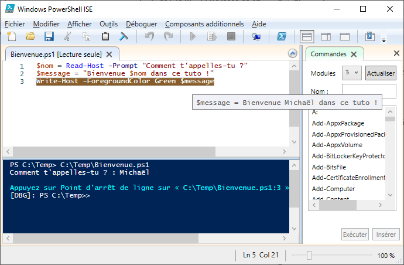

# Tutoriel : Prendre en main l’API PowerShell SI3P0.

Ce tutoriel montre comment l’API PowerShell SI3P0 peut permettre l’automatisation de traitements de données en lien avec un SIg construit sur PostgreSQL/Postgis.

Il est illustré par un cas pratique de téléchargement, d’import et d’exploitation des données de la Base Adresse Nationale.

_NDLR : Le terme API est peut-être mal choisi, le mot “toolkox” serait probablement plus adapté. Vu le nombre de références au dossier qui porte ce nom dans le code, j’avoue être faiblement motivé par l’idée de le renommer._

Pré-requis :
* Se dire que PowerShell, c’est comme tout, ça s’apprend.
* Avoir un SIg basé sur le couple PostgreSQL/Postgis.
* Avoir un client Windows qui :
    * permet la création et l’exécution de scripts PowerShell,
    * dispose des outils clients PostgreSQL/Postgis (dont principalement psql.exe),
    * dispose de ogr2ogr.exe.

Table des matières
1. SI3Pquoi ?
2. Pourquoi une boîte à outils ?
2.1. "Donnez-moi un T !"
2.2. "Donnez- moi un E ! Donnez-moi un L !"
2.3. ELT et TEL
2.4. Quelques mots sur PowerShell
3. API SI3P0 et BAN
3.1. Etape 1 - Préparer le contexte de travail
3.1.1. Récupérer l’API SI3P0

## 1. SI3Pquoi ?

SI3P0 pour Systèmes d’Information 3.0 ; c’est le nom donné au SIg que nous développons à la Mission des Systèmes d’Information (MSI) pour la direction “routes et bâtiments” du Gard. Il fait référence au logo de la collectivité et au code INSEE de notre [chauvin=’on’]magnifique département[chauvin=’off’].

## 2. Pourquoi une boîte à outils ?

Classiquement, un SIg se construit autour de 3 briques :
* un Système de Gestion de Bases de Données géographiques (SGBDg),
* des outils de visualisation,
* un logiciel d’extraction, de transformation et de chargement des données (ETL).

Lorsque les moyens financiers manquent, difficile de faire l’impasse sur le SGBDg et les outils de visualisation. Mais PostgreSQL/Postgis et QGis font très bien le job.

L’ETL est quant à lui remplacé par une brique moins onéreuse ; classiquement appelée le “Shadok”.
Le “Shadok” c’est quoi ? Et bien le “Shadok” c’est toi ;
* Toi qui télécharges tous les mois la dernière mise à jour des données avec ton navigateur favori.
* Toi qui fais “clic-droit > extraire vers" pour décompresser une à une les 42 archives fraîchement téléchargées.
* Toi qui enfin importes les données dans la base avec des outils graphiques type “Postgis Shapefile Import/Export Manager”.

A la MSI nous n’avons pas de budget alloué et notre équipe se compte sur les doigts d’une demi-main. Mais, comme tout bon informaticien qui se respecte...on est feignant !

### 2.1. "Donnez-moi un T !"

L’ETL transforme. Tu peux grâce à lui croiser, filtrer, grouper, sélectionner, adapter (et plein d’autres verbes à l’infinitif) tes données. Mais ceux qui suivent auront noté que dans SGBGg il y a “Gestion” et “Données”. Aussi, il est tout à fait possible de faire faire les transformations au serveur de bases. Le SGBDg n’est plus seulement vu comme la brique de stockage mais aussi comme serveur de (géo)traitements.

Ce principe selon lequel le “code” est placé au niveau du SGBD porte le nom de base épaisse. Ce n’est pas l’objet du tutoriel aussi je t’invite à [lire le “Plaidoyer de Frédéric Brouard” pour en savoir plus](https://www.yumpu.com/fr/document/read/51018012/plaidoyer-de-frederic-brouard-sur-le-concept-de-bases-de-donnees-epaisses). 

### 2.2. "Donnez- moi un E ! Donnez-moi un L !"

En revanche, le SGBD n’est pas l’outil le plus adapté pour interagir avec le système de fichiers même si certaines choses sont possibles ; foreign data, copy from file. Et surtout le SGBD n’ira pas récupérer la matière sur le net pour toi.

C’est là qu’intervient l’API. Celle-ci propose notamment des fonctions :
* de téléchargement,
* de manipulation d’archives dont certaines avec l’appui de 7-Zip,
* d’import-export de (géo)données via psql et ogr2ogr.

Elle donne également la possibilité de paralléliser les traitements grâce à ce que nous appelons des “jobs” qui lancent simultanément plusieurs processus. Il est ainsi possible d’exploiter au mieux les ressources machines et par conséquent de réduire les temps de traitement.

### 2.3. ELT et TEL

Puisqu’il est question de transformer les données grâce aux SGBDg, l’approche sera légèrement différente du classique schéma ETL.

En entrée, il faudra charger les données “au plus tôt” dans la base pour pouvoir les adapter au modèle cible ; ELT pour Extract Load Transform.

En sortie, il faudra extraire les données “au plus tard” après qu’elles aient été rendues compatibles avec le format attendu ; TEL pour Transform Extract Load.

### 2.4. Quelques mots sur PowerShell

PowerShell est à Windows ce que Bash est à Linux. Au placard donc les .BAT, c’est l’heure de faire des .PS1.

Ce langage de script propose de nombreuses cmdlet (prononcer commandlette) pour réaliser différentes opérations allant du simple Write-Host, pour écrire sur la sortie standard, au Invoke-WebRequest et ses multiples paramètres pour envoyer une requête HTTP/HTTPS.

Si malgré tout, tu ne trouves pas la cmdlet qu’il te faut, tu pourras créer tes propres fonctions et profiter de la richesse du Framework .NET sur lequel PowerShell s’appuie.

Comme PowerShell est inclus à Windows, même si tu n’as pas de droits administrateurs dans ton contexte professionnel, il est probable que tu ais accès à :
Windows PowerShell (powershell.exe) : l’interface ligne de commande,
Windows PowerShell ISE (powershell_ise.exe) : un éditeur de scripts simple mais complet puisqu’il permet l’exécution pas à pas et le debug.

## 3. API SI3P0 et BAN

L’API Adresse disponible sur Etalab propose la point d’entrée /search/ pour le géocodage. Lorsque le numéro est introuvable, un point au centre de la rue (type street) est retourné.

Dans notre cas, si le numéro est absent, nous souhaitons que le numéro le plus proche soit retourné. Nous avons pour cela automatisé le téléchargement et l’import des données de la BAN dans le SIg et avons développé une fonction PL/pgSQL de géocodage. Celle-ci est moins souple/puissante que la version Etalab et ne se base que sur les adresses présentent dans le SIg, mais elle est suffisante pour nos besoins.

Le tutoriel qui suit s’appuie sur ce cas d’usage.

### 3.1. Etape 1 - Préparer le contexte de travail

_"Nombreuses les étapes préparatoires sont, de patience t’armer tu dois"_. Je plaisante même s’il est vrai qu’il y a plusieurs choses à faire préalablement à l’utilisation de l’API. J’ai essayé de détailler ici les différents “level” à passer pour que tu sois ensuite opérationnel pour la rédaction de scripts PowerShell, c’est donc un peu verbeux mais pas forcément très long.

#### 3.1.1. Récupérer l’API SI3P0

L’API SI3P0, ainsi que le code propre à certains de nos cas d’usages, sont disponibles sous licence BSD-3 à l’emplacement suivant : [https://github.com/CD30-Devil/SI3P0](https://github.com/CD30-Devil/SI3P0)

Le sous-dossier API est suffisant mais les autres répertoires peuvent à minima servir d’exemple voire être réutilisables moyennant quelques adaptations (notamment pour les collègues territoriaux qui travaillent sur des thématiques équivalentes aux nôtres).

Commence donc par récupérer ce “repo” par téléchargement et extraction du Zip ou en créant un fork du projet.

(en construction)