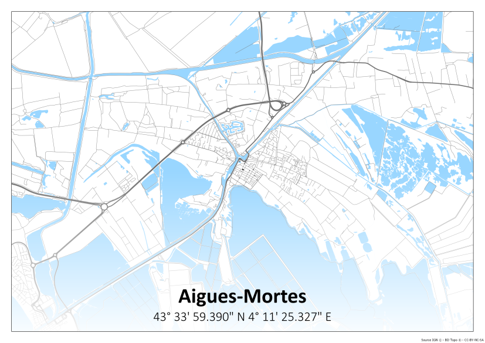
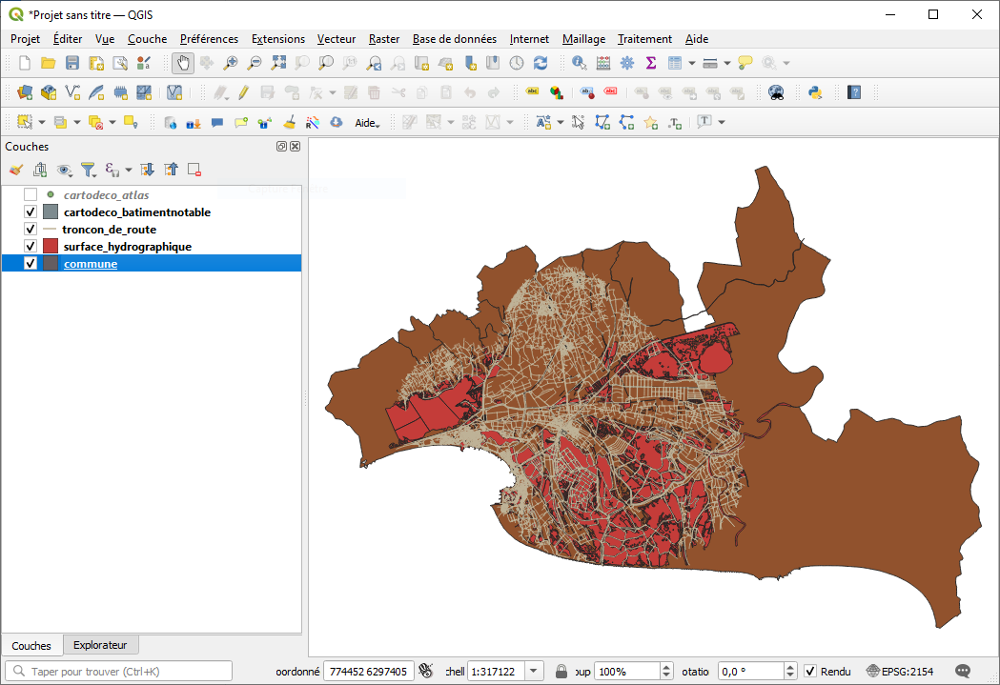
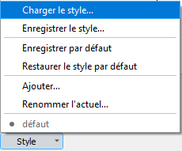
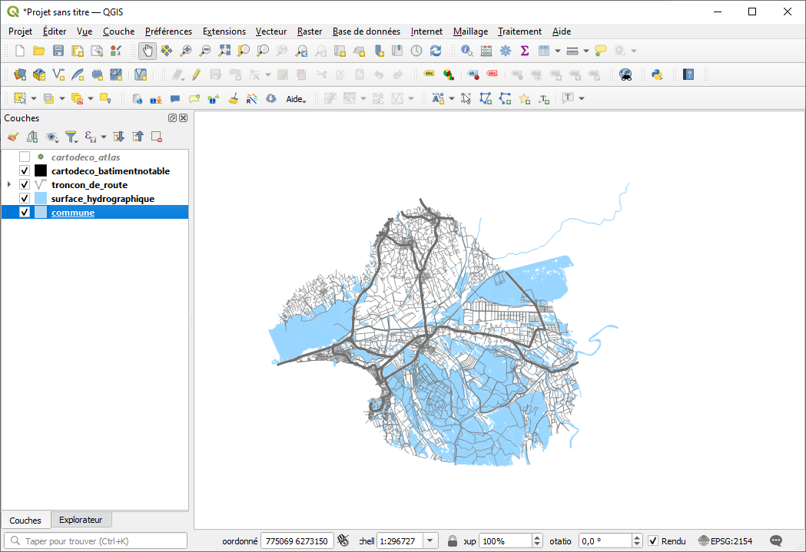
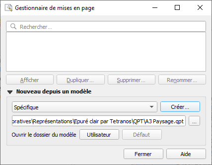
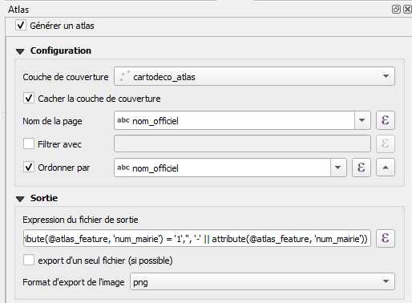
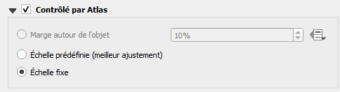

# Tutoriel : Décorer son intérieur avec une carte.

Tu as peut-être déjà vu, sur Internet ou en magasin, ces cartes décoratives de communes et tu penses qu'elles trouveraient bonne place dans ton bureau.

Mais bon, à 30€ le morçeau de papier tu hésites un peu et en plus c'est TA ville que tu voudrais avoir.



Dans ce tutoriel on te montre comment, avec les données de l'[IGN](https://geoservices.ign.fr/bdtopo){:target="_blank"}, une base [PostgreSQL](https://www.postgresql.org/){:target="_blank"}/[PostGIS](https://postgis.net/){:target="_blank"} et [QGis](https://qgis.org/fr/site/){:target="_blank"}, tu peux faire ta propre carte.
Tu utiliseras pour cela les styles et modèles d'impression que nous mettons à ta disposition.

Charge à toi, si le coeur t'en dit, de faire tes propres présentations et pourquoi pas de nous les proposer.
On pourra alors stocker et re-partager sur ce projet ta réalisation.

**Pré-requis :**

* Une base [PostgreSQL](https://www.postgresql.org/){:target="_blank"}/[PostGIS](https://postgis.net/){:target="_blank"}.
* [QGis](https://qgis.org/fr/site/){:target="_blank"}.
* Les données de la [BDTopo IGN](https://geoservices.ign.fr/bdtopo){:target="_blank"} sur l'emprise souhaitée.

**Ressources**

[https://github.com/CD30-Devil/SI3P0/tree/main/Cartes%20d%C3%A9coratives](https://github.com/CD30-Devil/SI3P0/tree/main/Cartes%20d%C3%A9coratives){:target="_blank"}

**Table des matières**

[1. Importer les données IGN](#_1)

[2. Produire la couche des bâtiments notables et celle pour l'atlas QGis](#_2)

&nbsp;&nbsp;&nbsp;&nbsp;[2.1. Couche des bâtiments notables](#_21)

&nbsp;&nbsp;&nbsp;&nbsp;[2.2. Couche d'atlas](#_22)

[3. Créer le projet QGis](#_3)

&nbsp;&nbsp;&nbsp;&nbsp;[3.1. Ajouter les couches](#_31)

&nbsp;&nbsp;&nbsp;&nbsp;[3.2. Appliquer les styles](#_32)

&nbsp;&nbsp;&nbsp;&nbsp;[3.3. Importer les modèles d'impression](#_33)

&nbsp;&nbsp;&nbsp;&nbsp;[3.4. Exporter une ou plusieurs cartes](#_34)

[4. Conclusion](#_4)

## <a name="_1"></a>1. Importer les données IGN

La première étape consiste à intégrer les données IGN dans la base PostgreSQL/PostGIS.

Tu as besoin des cinq données suivantes :
* la classe `batiment` du thème **Bâti**,
* la classe `commune` du thème **Administratif**,
* la classe `surface_hydrographique` du thème **Hydrographie**,
* la classe `troncon_de_route` du thème **Transport**,
* la classe `zone_d_activite_ou_d_interet` du thème **Services et activités**.

Plusieurs méthodes sont possibles pour intégrer les données mais, ici, nous avons pour habitude de travailler avec la version SQL de la France métropolitaine.
Certains fichiers y sont trés volumineux dont notamment les classes `batiment` et `troncon_de_route` qui pèsent chacune plusieurs Go une fois décompréssées.

Pas de panique, tu peux à la place utiliser les versions découpées par EPCI, Département et Région que nous mettons à ta disposition sur [cet espace OneDrive](https://gardfr-my.sharepoint.com/:f:/g/personal/michael_galien_gard_fr/Eqoe4M0WjcZCpUUmNq7HXGwBSA6QeTjDlRKE4O7mAeMYXA){:target="_blank"}.

Ces découpages proposent une zone tampon de 5 km autour de l'emprise ce qui devrait permettre de produire une carte sans trou même si la commune souhaitée est en limite.

L'exécution d'un fichier SQL, et donc la création des structures et l'import des données, se fait à l'aide de l'outil [psql](https://www.postgresql.org/docs/current/app-psql.html){:target="_blank"}.

L'appel à psql se fait grâce à une commande du type :
```
psql
    --host=<serveur>
    --port=<port>
    --dbname=<bdd>
    --username=<utilisateur>
    --file="<chemin vers le fichier SQL>"
```

Il est aussi possible de jouer un ordre SQL simple avec une ligne de commande ainsi construite :
```
psql
    --host=<serveur>
    --port=<port>
    --dbname=<bdd>
    --username=<utilisateur>
    --command='<ordre SQL à exécuter>'
```

Tu as peut-être noté que l'outil psql ne prend pas en paramètre le mot de passe utilisateur.
PostgreSQL propose différents modes d'authentification et il existe plusieurs techniques pour renseigner le mot de passe que ce soit par la [variable d'environnement `PGPASSWORD`](https://www.postgresql.org/docs/current/libpq-envars.html){:target="_blank"} ou en utilisant un [fichier de mots de passe](https://www.postgresql.org/docs/current/libpq-pgpass.html){:target="_blank"}.
A défaut, psql affichera un prompt de saisie du mot de passe immédiatement après son lancement.

Il faut par ailleurs bien définir l'encodage utilisé par le client (éventuellement via la variable d'environnement `PGCLIENTENCODING`) sachant que les fichiers de découpage sont mis à disposition en UTF8.

Dans le projet, nous avons mis pour exemple [les fichiers SQL](https://github.com/CD30-Devil/SI3P0/tree/main/Cartes%20d%C3%A9coratives/Donn%C3%A9es){:target="_blank"} correspondants à la [communauté de communes Terre de Camargue](http://www.terredecamargue.fr/){:target="_blank"}.
Nous mettons également à ta disposition un [modèle PowerShell de séquencement des appels dans le dossier PSQL](https://github.com/CD30-Devil/SI3P0/blob/main/Cartes%20d%C3%A9coratives/PSQL/lancement%20psql.ps1){:target="_blank"}.

## <a name="_2"></a>2. Produire la couche des bâtiments notables et celle pour l'atlas QGis

Deux couches, déduites des données IGN, sont nécessaires pour la construction des cartes.

### <a name="_21"></a>2.1. Couche des bâtiments notables

Le nombre de bâtiments dans les données de l'IGN peut-être réellement conséquent.

Plutôt que d'utiliser un filtre sous QGis, qui pourrait ralentir le travail de cartographie, on précalcule les bâtiments notables à afficher.
On utilise pour cela une [vue materialisée](https://www.postgresql.org/docs/current/rules-materializedviews.html){:target="_blank"} qui va extraire des bâtiments ceux à représenter.

L'ordre de création de cette vue est le suivant :
```sql
create materialized view cartodeco_batimentnotable as
select
    row_number() over () as id,
    geometrie
from batiment
where nature in (
    'Arc de triomphe',
    'Arène ou théâtre antique',
    'Chapelle',
    'Château',
    'Eglise',
    'Fort, blockhaus, casemate',
    'Monument',
    'Tour, donjon'
);
```

Il est disponible dans le fichier [Bâtiments notables.sql](https://github.com/CD30-Devil/SI3P0/blob/main/Cartes%20d%C3%A9coratives/Vues/B%C3%A2timents%20notables.sql){:target="_blank"}.

### <a name="_22"></a>2.2. Couche d'atlas

L'[outil atlas de QGis](https://docs.qgis.org/3.22/fr/docs/training_manual/forestry/forest_maps.html){:target="_blank"} permet de produire de façon automatique plusieurs cartes d'un même format.
Cette production se fait à l'appui d'une couche dont la géographie et les attributs sont utilisés pour "contrôler" l'impression.

Sur le plan géographique, la couche d'atlas que nous calculons ici vise à privilégier l'affichage des zones agglomérées.
Pour cela, l'idée est de centrer les cartes sur les mairies celles-ci étant souvent au coeur des communes.

Les attributs, quant à eux, sont utiles pour renseigner les étiquettes des modèles d'impression.

Cette vue est calculée grâce à l'ordre suivant :
```sql
create materialized view cartodeco_atlas as
select
    row_number() over () as id,
    c.code_insee,
    c.nom_officiel,
    row_number() over (partition by c.code_insee) as num_mairie,
    ST_AsLatLonText(ST_Transform(ST_Centroid(zai.geometrie), 4326), 'D° M'' S.SSS" C') as coordonnees,
    c.population,
    ST_Centroid(zai.geometrie) as geometrie
from zone_d_activite_ou_d_interet zai
inner join commune c on ST_Intersects(c.geometrie, zai.geometrie)
where nature = 'Mairie'
and (nature_detaillee is null or nature_detaillee = 'Hôtel de ville');
```

Il est disponible dans le fichier [Atlas.sql](https://github.com/CD30-Devil/SI3P0/blob/main/Cartes%20d%C3%A9coratives/Vues/Atlas.sql){:target="_blank"}.

## <a name="_3"></a>3. Créer le projet QGis

A ce stade, toutes les données sont disponibles pour produire les cartes.
Il est désormais question de créer le projet QGis.

### <a name="_31"></a>3.1. Ajouter les couches

Pour pouvoir créer la carte, tu dois préalablement paramétrer dans QGis la connexion à la base PostgreSQL/PostGIS porteuse des données grâce au [panneau Explorateur](https://docs.qgis.org/3.22/fr/docs/user_manual/managing_data_source/opening_data.html#the-browser-panel){:target="_blank"}.

Ensuite, il faut créer un nouveau projet et y ajouter les 5 couches suivantes ainsi ordonnées :
* cartodeco_atlas (dont l'affichage est à désactiver)
* cartodeco_batimentnotable
* troncon_de_route
* surface_hydrographique
* commune

Ces étapes doivent aboutir à un résultat proche de l'aperçu ci-dessous.



### <a name="_32"></a>3.2. Appliquer les styles

QGis applique de façon aléatoire un style aux couches lorsque celles-ci sont ajoutées au projet.

A cette étape, il te faut modifier les styles des couches visibles en rechargeant pour chacune le fichier QML correspondant disponible [à cet emplacement](https://github.com/CD30-Devil/SI3P0/tree/main/Cartes%20d%C3%A9coratives/Repr%C3%A9sentations/Epur%C3%A9%20clair%20par%20Tetranos/QML){:target="_blank"}.
Le chargement se fait, depuis la fenêtre de propriétés de la couche, grâce au menu "Style > Charger le style...".



Après avoir appliqué les quatre fichiers QML, ton projet devrait ressembler à l'image qui suit.



Tu te demandes peut-être pourquoi les communes sont blanches et donc a priori invisibles.
Cette astuce permet de fixer un fond bleu à la carte dans le modèle d'impression et ainsi faire apparaître les côtes pour les communes en bordure de mer et d'océan.

### <a name="_33"></a>3.3. Importer les modèles d'impression

Quatres modèles d'impression QPT sont disponibles [dans ce dossier](https://github.com/CD30-Devil/SI3P0/tree/main/Cartes%20d%C3%A9coratives/Repr%C3%A9sentations/Epur%C3%A9%20clair%20par%20Tetranos/QPT){:target="_blank"} :
* un format 18x24 Portrait,
* un format A3 Portrait,
* un format A3 Paysage,
* un format A3 Quiz où le nom de la commune est masqué et remplacé par une question-indice.

Depuis le gestionnaire de mises en page, choisis l'option "Spécifique" et indique le chemin vers le modèle à importer. Clique ensuite sur "Créer..." et renseigne un nom avant de valider.



Le composeur d'impression s'ouvre et présente la mise en page telle que définie par le modèle QPT.
Dans celle-ci, l'atlas est normalement pré-paramétré [avec la couche créée à l'étape 2.2](#_22).



L'objet carte principal est quant à lui contrôlé par l'atlas.



### <a name="_34"></a>3.4. Exporter une ou plusieurs cartes


## <a name="_4"></a>4. Conclusion

Pour la MSI,

Michaël Galien - [@Tetranos](https://twitter.com/tetranos){:target="_blank"}