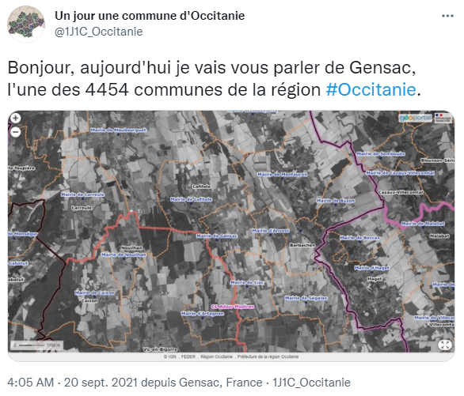

# Tutoriel : Réaliser un (Géo)Bot Twitter.

On trouve sur Twitter de nombreux comptes Bot qui diffusent de façon régulière des informations.

Par exemple, et pour ne citer que les plus utiles, il y a :
* [@whataweekhuh](https://twitter.com/whataweekhuh){:target="_blank"} - où Tintin nous rappelle chaque mercredi que c'est mercredi,
* [@year_progress](https://twitter.com/year_progress){:target="_blank"} - qui nous aide à patienter jusqu'au réveillon du nouvel an grâce à une barre de progression de l'année en cours façon code ASCII.

Ce tutoriel te propose de créer un Bot Twitter avec l'aide des sources que nous mettons à ta disposition.
Pour cela, tu vas utiliser les fonctions d'appel à l'API standard v1.1 de Twitter présentes dans le fichier [fonctions_twitter.ps1](https://github.com/CD30-Devil/SI3P0/blob/main/API/PowerShell/fonctions_twitter.ps1){:target="_blank"}.

Ce fichier est indépendant des autres sources, MAIS, comme on aime bien la Géo ici, on va créer un GéoBot et donc utiliser un peu plus largement les fonctions de la boîte à outils SI3P0 notamment pour l'accès au SIg. On va également exploiter les données de notre base géographique si bien que, si tu souhaites réaliser ton propre GéoBot, il te faudra adapter la partie extraction de données.

**Pré-requis :**

* Avoir un poste Windows pouvant exécuter du PowerShell (testé en 5.1).
* Pour faire un Bot simple : télécharger et référencer ([en Dot-Sourcing](https://mcpmag.com/articles/2017/02/02/exploring-dot-sourcing-in-powershell.aspx){:target="_blank"}) le fichier [fonctions_twitter.ps1](https://github.com/CD30-Devil/SI3P0/blob/main/API/PowerShell/fonctions_twitter.ps1){:target="_blank"}.
* Pour faire un GéoBot avec la boîte à outils SI3P0 : [avoir suivi le tuto de prise en main de l'API SI3P0](/SI3P0/MD/API - Prise en main.html){:target="_blank"}.

**Table des matières**

[1. @MonBotTwitter](#_1)

[2. Le fichier fonctions_twitter.ps1](#_2)

&nbsp;&nbsp;&nbsp;&nbsp;[2.1. Appel à une fonction "mappée" de l'API Twitter](#_21)

&nbsp;&nbsp;&nbsp;&nbsp;[2.2. Appel à une autre fonction de l'API Twitter](#_22)

[3. Donnons vie au bot !](#_3)

&nbsp;&nbsp;&nbsp;&nbsp;[3.1. Dot-Sourcing](#_31)

&nbsp;&nbsp;&nbsp;&nbsp;[3.2. Constantes et nettoyage préalable](#_32)

&nbsp;&nbsp;&nbsp;&nbsp;[3.3. Préparation des données](#_33)

&nbsp;&nbsp;&nbsp;&nbsp;[3.4. Création de l'objet d'identification](#_34)

&nbsp;&nbsp;&nbsp;&nbsp;[3.5. Publication du 1er tweet](#_35)

&nbsp;&nbsp;&nbsp;&nbsp;[3.6. Publication du 2ème tweet](#_36)

&nbsp;&nbsp;&nbsp;&nbsp;[3.7. Publication des tweets suivants](#_37)

[4. Conclusion](#_4)

## <a name="_1"></a>1. @MonBotTwitter

Avant de t'attaquer à la partie développement, tu dois :
1. Créer le compte Twitter du Bot.
2. Demander un accès développeur à l'API standard (gratuite) v1.1 via un formulaire où tu devras préciser à _"la firme"_ tes intentions.
3. Créer un projet.
4. Ajouter une application au projet et noter ses identifiants (_API Key_, _API Key Secret_, _Bearer Token_ ; ce dernier est proposé automatiquement à la création de l'app mais n'est pas utile pour ce tuto).
5. Modifier les permissions de l'application en _Read and Write_.
6. Générer et conserver les _Access Token_ et _Access Secret Token_ pour l'application.

Bien que facultative, tu peux aussi activer l'option _Ajouter des informations de localisation à vos Tweets_.
Tu pourras ainsi ajouter les coordonnées aux tweets publiés par ton Bot afin de les géolocaliser.

Toute la documentation nécessaire est disponible en ligne que ce soit dans l'aide Twitter ou via différents tutos.

Ci-dessous quelques liens qui devraient t'aider :
* [S'inscrire sur Twitter (FR)](https://help.twitter.com/fr/using-twitter/create-twitter-account){:target="_blank"}.
* [Demander un accès développeur (EN)](https://developer.twitter.com/en/apply-for-access){:target="_blank"}.
* [Vu d'ensemble des projets et apps (EN - accessible après création du compte développeur)](https://developer.twitter.com/en/portal/projects-and-apps){:target="_blank"}.
* [A propos des API Twitter (FR)](https://help.twitter.com/fr/rules-and-policies/twitter-api){:target="_blank"}.
* [Documentation de la plateforme développeur (EN)](https://developer.twitter.com/en/docs){:target="_blank"}.

## <a name="_2"></a>2. Le fichier fonctions_twitter.ps1

Le fichier [fonctions_twitter.ps1](https://github.com/CD30-Devil/SI3P0/blob/main/API/PowerShell/fonctions_twitter.ps1){:target="_blank"} est découpé en régions avec :
* une première région dans laquelle on trouve la machinerie d'appel,
* suivie de régions correspondantes aux sections de la documentation de l'API disponible à l'adresse [https://developer.twitter.com/en/docs/twitter-api/v1](https://developer.twitter.com/en/docs/twitter-api/v1){:target="_blank"}.

Au moment où je rédige ces lignes, seules quelques fonctions nécessaires à nos besoins internes ont été "mappées".
Cependant, la tuyauterie est là et l'appel aux autres fonctions ne devrait pas trop poser de problèmes.

### <a name="_21"></a>2.1. Appel à une fonction "mappée" de l'API Twitter

Pour l'heure, les fonctions "mappées" de l'API sont :
* `Twitter-Modifier-Statut`, cf. [https://developer.twitter.com/en/docs/twitter-api/v1/tweets/post-and-engage/api-reference/post-statuses-update](https://developer.twitter.com/en/docs/twitter-api/v1/tweets/post-and-engage/api-reference/post-statuses-update){:target="_blank"}.

* `Twitter-Effacer-Statut`, cf. [https://developer.twitter.com/en/docs/twitter-api/v1/tweets/post-and-engage/api-reference/post-statuses-destroy-id](https://developer.twitter.com/en/docs/twitter-api/v1/tweets/post-and-engage/api-reference/post-statuses-destroy-id){:target="_blank"}.

* `Twitter-Obtenir-Statuts`, cf. [https://developer.twitter.com/en/docs/twitter-api/v1/tweets/timelines/api-reference/get-statuses-home_timeline](https://developer.twitter.com/en/docs/twitter-api/v1/tweets/timelines/api-reference/get-statuses-home_timeline){:target="_blank"}.

* `Twitter-Televerser-Media`, cette fonction étant en fait une succession de plusieurs appels :
    * `INIT`, cf. [https://developer.twitter.com/en/docs/twitter-api/v1/media/upload-media/api-reference/post-media-upload-init](https://developer.twitter.com/en/docs/twitter-api/v1/media/upload-media/api-reference/post-media-upload-init){:target="_blank"},
    * `APPEND`, cf. [https://developer.twitter.com/en/docs/twitter-api/v1/media/upload-media/api-reference/post-media-upload-append](https://developer.twitter.com/en/docs/twitter-api/v1/media/upload-media/api-reference/post-media-upload-append){:target="_blank"},
    * `FINALIZE`, cf. [https://developer.twitter.com/en/docs/twitter-api/v1/media/upload-media/api-reference/post-media-upload-finalize](https://developer.twitter.com/en/docs/twitter-api/v1/media/upload-media/api-reference/post-media-upload-finalize){:target="_blank"}.
    
* `Twitter-Televerser-Media-Simple`, cf. [https://developer.twitter.com/en/docs/twitter-api/v1/media/upload-media/api-reference/post-media-upload](https://developer.twitter.com/en/docs/twitter-api/v1/media/upload-media/api-reference/post-media-upload){:target="_blank"}.

Toutes ces fonctions prennent un paramètre obligatoire qui permet l'identification auprès de Twitter.
Celui-ci est obtenu par appel à la fonction `Twitter-Creer-Identifiants`.

### <a name="_22"></a>2.2. Appel à une autre fonction de l'API Twitter

Si tu regardes le code des fonctions "mappées", tu pourras voir que chaque appel est une succession de 3 fonctions.

1. `Twitter-Preparer-Appel`

    Cette fonction construit un `pscustomobject` contenant l'ensemble des informations utiles à l'appel en préparation. On y trouve :
    * l'URL,
    * la méthode (_GET_ / _POST_),
    * pour les appels en _POST_, le type MIME du corps de la requête (_application/x-www-form-urlencoded_, _multipart/form-data_),
    * les paramètres.

    L'objet retourné sert à calculer la signature d'appel grâce à la fonction `Twitter-Calculer-Signature`.

    Si t'as du temps à perdre, les détails sont ici : [https://developer.twitter.com/en/docs/authentication/oauth-1-0a/creating-a-signature](https://developer.twitter.com/en/docs/authentication/oauth-1-0a/creating-a-signature){:target="_blank"} mais en gros cette signature permet le calcul de l'entête _OAuth_ qui sert à authentifier l'appelant.

    Si tu n'as pas assez perdu de temps avec le lien précédent, tu peux aussi regarder celui là : [https://developer.twitter.com/en/docs/authentication/oauth-1-0a/authorizing-a-request](https://developer.twitter.com/en/docs/authentication/oauth-1-0a/authorizing-a-request){:target="_blank"}.

    Ce même objet est également passé à la fonction `Twitter-Appeler` pour invoquer l'API.

2. `Twitter-Calculer-Signature`

    Et bien tu sais déjà tout ou presque, la fonction calcule la signature et l'ajoute au `pscustomobject` reçu en entrée, histoire de refiler l'info à la fonction `Twitter-Appeler`.

3. `Twitter-Appeler`

    La fonction `Twitter-Appeler` appelle Twitter. Surpris ?

    Le résultat de l'appel est désérialisé (merci [Invoke-RestMethod](https://docs.microsoft.com/en-us/powershell/module/microsoft.powershell.utility/invoke-restmethod?view=powershell-7.1){:target="_blank"}) et retourné.


    Du coup, il devrait être assez simple d'appeler une fonction non "mappée"..._"enfin j'sais pas, enfin peut-être"_.

    [](https://www.youtube.com/watch?v=UhjWQKr0b0g){:target="_blank"}

## <a name="_3"></a>3. Donnons vie au bot !

Le compte Twitter est actif et nous avons rapidement passé en revue les fonctions ; il est désormais temps de donner vie au bot.

### <a name="_31"></a>3.1. Dot-sourcing

Il est question ici d'importer les fichiers nécessaires à la création du Bot.

```powershell
# import des fichiers nécessaires par Dot-Sourcing
$cheminAPISI3P0 = "$PSScriptRoot\..\..\..\API\PowerShell\"

#. ("$cheminAPISI3P0\fonctions_twitter.ps1")
#. ("$cheminAPISI3P0\fonctions_chromium.ps1") # utilise constantes.ps1
. ("$cheminAPISI3P0\api_complète.ps1")
```

Nous utilisons pour ce tuto l'API complète mais tu peux te limiter au fichier [fonctions_twitter.ps1](https://github.com/CD30-Devil/SI3P0/blob/main/API/PowerShell/fonctions_twitter.ps1){:target="_blank"}.

Le fichier [fonctions_chromium.ps1](https://github.com/CD30-Devil/SI3P0/blob/main/API/PowerShell/fonctions_chromium.ps1){:target="_blank"} est également facultatif. Il permet de faire des "captures d'écrans" de pages Web à l'aide d'un navigateur Chromium.
Si tu inclus ce fichier, sache qu'il utilise [constantes.ps1](https://github.com/CD30-Devil/SI3P0/blob/main/API/PowerShell/constantes.ps1){:target="_blank"} pour connaitre le chemin vers l'exécutable du navigateur à utiliser.

### <a name="_32"></a>3.2. Constantes et nettoyage préalable

Vient ensuite le paramètrage du script par la création de plusieurs constantes.

D'une part, on définit un chemin vers un dossier temporaire de travail.

D'autre part, c'est à ce niveau que l'on renseigne les différentes clés et clés secrètes obtenues lors de la création de l'application sur Twitter.
A toi de choisir si tu souhaites les mettre directement dans le code ou bien les récupèrer avec une autre méthode...ces clés devant logiquement rester confidentielles.

```powershell
# constantes
$dossierTemp = "$PSScriptRoot\Temp"

$cleBotTwitter = '<API Key>' # API Key
$cleSecreteBotTwitter = '<API Secret Key>' # API Secret Key
$jetonBotTwitter = '<Access Token>' # Access Token
$jetonSecretBotTwitter = '<Access Secret Token>' # Access Secret Token

# nettoyage préalable
Remove-Item -Path "$dossierTemp\*.*"
```

Au passage, on réalise un nettoyage préalable du dossier de travail.

### <a name="_33"></a>3.3. Préparation des données

Préparer les données, ce n'est ni plus ni moins qu'extraire de la base SIg les informations nécessaires à la rédaction des tweets.
Ici, on récupère de la base différentes informations concernant une des communes de la région Occitanie.

Le résultat de la requête est exporté dans un fichier CSV qui est relu par le script en vue de la publication des messages.

```powershell
# préparation des données
SIg-Exporter-CSV `
    -csv "$dossierTemp\infos_commune_aleatoire.csv" `
    -requete @"
with InfosDepartement as (
    select d.COGDepartement, sum(Population) as Population, count(c.COGCommune) as NbCommunes
    from m.Commune c
    inner join m.Departement d on c.COGDepartement = d.COGDepartement
    group by d.COGDepartement
),
InfosRegion as (
    select r.COGRegion, sum(Population) as Population, count(c.COGCommune) as NbCommunes
    from m.Commune c
    inner join m.Departement d on c.COGDepartement = d.COGDepartement
    inner join m.Region r on d.COGRegion = r.COGRegion
    group by r.COGRegion
),
InfosCommune as (
    select
        c.COGCommune, c.Nom as NomCommune, c.CodePostal as CPCommune, round(ST_Area(c.Geom)::numeric / 10000) as HectaresCommune, c.Population as PopulationCommune,
        
        d.COGDepartement, d.Nom as NomDepartement, id.NbCommunes as NbCommunesDepartement,
        row_number() over(partition by d.COGDepartement order by ST_Area(c.Geom) desc) as PositionSuperficieDepartement,
        round((ST_Area(c.Geom)::numeric * 1000 / ST_Area(d.Geom)::numeric), 3) as PartSuperficieDepartement,
        row_number() over(partition by d.COGDepartement order by c.Population desc) as PositionPopulationDepartement,
        round((c.Population::numeric * 1000 / id.Population), 3) as PartPopulationDepartement,
        
        r.COGRegion, r.Nom as NommRegion, ir.NbCommunes as NbCommunesRegion,
        row_number() over(partition by r.COGRegion order by ST_Area(c.Geom) desc) as PositionSuperficieRegion,
        round((ST_Area(c.Geom)::numeric * 1000 / ST_Area(r.Geom)::numeric), 3) as PartSuperficieRegion,
        row_number() over(partition by r.COGRegion order by c.Population desc) as PositionPopulationRegion,
        round((c.Population::numeric * 1000 / ir.Population), 3) as PartPopulationRegion,
        
        ST_X(ST_Transform(ST_Centroid(c.Geom), 4326)) as X,
        ST_Y(ST_Transform(ST_Centroid(c.Geom), 4326)) as Y,
        
        '"https://www.geoportail.gouv.fr/carte?c=' || ST_X(ST_Transform(ST_Centroid(c.Geom), 4326)) || ',' || ST_Y(ST_Transform(ST_Centroid(c.Geom), 4326)) || '&z=13&l0=ORTHOIMAGERY.ORTHOPHOTOS::GEOPORTAIL:OGC:WMTS(1)&l1=LIMITES_ADMINISTRATIVES_EXPRESS.LATEST::GEOPORTAIL:OGC:WMTS(1)&permalink=yes"' as LienGeoportail,
        '"https://www.geoportail.gouv.fr/embed/visu.html?c=' || ST_X(ST_Transform(ST_Centroid(c.Geom), 4326)) || ',' || ST_Y(ST_Transform(ST_Centroid(c.Geom), 4326)) || '&z=13&l0=ORTHOIMAGERY.ORTHOPHOTOS::GEOPORTAIL:OGC:WMTS(1;g)&l1=LIMITES_ADMINISTRATIVES_EXPRESS.LATEST::GEOPORTAIL:OGC:WMTS(1)&permalink=yes"' as LienGeoportailLimiteAdm,
        '"https://www.geoportail.gouv.fr/embed/visu.html?c=' || ST_X(ST_Transform(ST_Centroid(c.Geom), 4326)) || ',' || ST_Y(ST_Transform(ST_Centroid(c.Geom), 4326)) || '&z=13&l0=ORTHOIMAGERY.ORTHOPHOTOS::GEOPORTAIL:OGC:WMTS(1;g)&l1=INSEE.FILOSOFI.POPULATION::GEOPORTAIL:OGC:WMTS(0.8)&l2=LIMITES_ADMINISTRATIVES_EXPRESS.LATEST::GEOPORTAIL:OGC:WMTS(1)&permalink=yes"' as LienGeoportailDensitePop,
        '"https://www.geoportail.gouv.fr/embed/visu.html?c=' || ST_X(ST_Transform(ST_Centroid(c.Geom), 4326)) || ',' || ST_Y(ST_Transform(ST_Centroid(c.Geom), 4326)) || '&z=13&l0=OCSGE.COUVERTURE::GEOPORTAIL:OGC:WMTS(0.6)&l1=LIMITES_ADMINISTRATIVES_EXPRESS.LATEST::GEOPORTAIL:OGC:WMTS(1)&permalink=yes"' as LienGeoportailODS,
        '"https://www.amf.asso.fr/annuaire-communes-intercommunalites?refer=commune&insee=' || COGCommune || '"' as LienAMF
        
    from m.Commune c
    inner join m.Departement d on c.COGDepartement = d.COGDepartement
    inner join InfosDepartement id on d.COGDepartement = id.COGDepartement
    inner join m.Region r on d.COGRegion = r.COGRegion
    inner join InfosRegion ir on r.COGRegion = ir.COGRegion
    where d.COGRegion = '76'
)
select *
from InfosCommune
order by random()
limit 1
"@

$infosCommune = Import-Csv `
    -Delimiter ';' `
    -Path "$dossierTemp\infos_commune_aleatoire.csv" | select -First 1
```

### <a name="_34"></a>3.4. Création de l'objet d'identification

Ultime étape avant d'invoquer l'API Twitter : la création de l'objet d'identification qui sera passé aux différentes fonctions.

L'objet est construit grâce aux constantes définies à l'étape [3.2. Constantes et nettoyage préalable](#_32).

```powershell
# création de l'objet d'identification
$idsTwitter = Twitter-Creer-Identifiants `
    -cle $cleBotTwitter `
    -cleSecrete $cleSecreteBotTwitter `
    -jeton $jetonBotTwitter `
    -jetonSecret $jetonSecretBotTwitter
````

### <a name="_35"></a>3.5. Publication du 1er tweet

L'idée est de présenter chaque jour une commune aléatoirement choisie parmi celles de la région Occitanie.
Le premier tweet va annoncer la commune retenue en associant au message un aperçu de ses limites administratives visibles sur le [Géoportail](https://www.geoportail.gouv.fr/){:target="_blank"}.

Préalablement à l'envoi du message, on réalise une capture d'écran du site de l'IGN. On utilise pour cela l'URL du permalien calculée par la requête au moment de [la préparation des données](#_33) et la fonction `Chromium-Capturer-Page` présente dans [fonctions_chromium.ps1](https://github.com/CD30-Devil/SI3P0/blob/main/API/PowerShell/fonctions_chromium.ps1){:target="_blank"}.

```powershell
Chromium-Capturer-Page `
    -url $infosCommune.LienGeoportailLimiteAdm `
    -sortie "$dossierTemp\$($infosCommune.COGCommune)_limite_adm.png" `
    -delai 30000
```

Ensuite, l'image obtenue est téléversée vers Twitter. Le retour de l'API est stocké dans la variable `$retour` dont l'attribut `media_id` donne l'identifiant du média à référencer dans le tweet.

```powershell
$retour = Twitter-Televerser-Media `
    -identifiants $idsTwitter `
    -cheminMedia "$dossierRapports\$($infosCommune.COGCommune)_limite_adm.png"

$idMedia = $retour.media_id
```

Il ne reste alors plus qu'à modifier le statut. Le message, en plus d'être géoréférencé grâce aux paramètres X et Y, est associé au média téléversé à l'étape précédente.

```powershell
$retour = Twitter-Modifier-Statut `
    -identifiants $idsTwitter `
    -lat $infosCommune.Y `
    -long $infosCommune.X `
    -idMedias $idMedia `
    -statut @"
Bonjour, aujourd'hui je vais vous parler de $($infosCommune.NomCommune), l'une des $($infosCommune.NbCommunesRegion) communes de la région #Occitanie.
"@

$idMessage = $retour.id
```

Le résultat d'appel permet de récupérer l'identifiant du tweet via l'attribut `id`. Celui-ci sera utile pour le deuxième tweet.

Ce premier message est quant à lui aussitôt visible sur Twitter. Je te conseille de faire attention aux @mentions dans les messages, car Twitter a la suspension de compte rapide et pourrait considérer cela comme du spam.



### <a name="_36"></a>3.6. Publication du 2ème tweet

Le deuxième message est envoyé en réponse au précédent de sorte à créer un _"thread"_.

```powershell
$retour = Twitter-Modifier-Statut `
    -identifiants $idsTwitter `
    -lat $infosCommune.Y `
    -long $infosCommune.X `
    -enReponseA $idMessage `
    -statut @"
Le Code Officiel Géographique (COG) de $($infosCommune.NomCommune) est : $($infosCommune.COGCommune).
Son code postal est : $($infosCommune.CPCommune).
"@

$idMessage = $retour.id
```

### <a name="_37"></a>3.7. Publication des tweets suivants

La suite est une succession de messages, chacun étant envoyé en réponse à celui qui le précède.

```powershell
# Message 3 - Département
$retour = Twitter-Modifier-Statut `
    -identifiants $idsTwitter `
    -lat $infosCommune.Y `
    -long $infosCommune.X `
    -enReponseA $idMessage `
    -statut @"
Vous l'aurez peut-être devinez, le département de $($infosCommune.NomCommune) est : $($infosCommune.NomDepartement) ($($infosCommune.COGDepartement)).
"@

$idMessage = $retour.id

# Message 4 - Population
Chromium-Capturer-Page `
    -url $infosCommune.LienGeoportailDensitePop `
    -sortie "$dossierRapports\$($infosCommune.COGCommune)_densite_pop.png" `
    -delai 30000

$retour = Twitter-Televerser-Media `
    -identifiants $idsTwitter `
    -cheminMedia "$dossierRapports\$($infosCommune.COGCommune)_densite_pop.png"

$idMedia = $retour.media_id

$retour = Twitter-Modifier-Statut `
    -identifiants $idsTwitter `
    -lat $infosCommune.Y `
    -long $infosCommune.X `
    -enReponseA $idMessage `
    -idMedias $idMedia `
    -statut @"
Sa population est de $($infosCommune.PopulationCommune) hab. ce qui la place en numéro $($infosCommune.PositionPopulationDepartement)/$($infosCommune.NbCommunesDepartement) dans son département et en $($infosCommune.PositionPopulationRegion)/$($infosCommune.NbCommunesRegion) en #Occitanie.

Cela représente $($infosCommune.PartPopulationDepartement) ‰ de la population du département et $($infosCommune.PartPopulationRegion) ‰ de la région.
"@

$idMessage = $retour.id

# Message 5 - Superficie
Chromium-Capturer-Page `
    -url $infosCommune.LienGeoportailODS `
    -sortie "$dossierRapports\$($infosCommune.COGCommune)_ods.png" `
    -delai 30000

$retour = Twitter-Televerser-Media `
    -identifiants $idsTwitter `
    -cheminMedia "$dossierRapports\$($infosCommune.COGCommune)_ods.png"

$idMedia = $retour.media_id

$retour = Twitter-Modifier-Statut `
    -identifiants $idsTwitter `
    -lat $infosCommune.Y `
    -long $infosCommune.X `
    -enReponseA $idMessage `
    -idMedias $idMedia `
    -statut @"
Sa superficie est de $($infosCommune.HectaresCommune) hect. ce qui la place en numéro $($infosCommune.PositionSuperficieDepartement)/$($infosCommune.NbCommunesDepartement) dans son département et en $($infosCommune.PositionSuperficieRegion)/$($infosCommune.NbCommunesRegion) en #Occitanie.

Cela représente $($infosCommune.PartSuperficieDepartement) ‰ de la superficie du département et $($infosCommune.PartSuperficieRegion) ‰ de la région.
"@

$idMessage = $retour.id

# Message 6 - AMF
Chromium-Capturer-Page `
    -url $infosCommune.LienAMF `
    -sortie "$dossierRapports\$($infosCommune.COGCommune)_amf.png" `
    -delai 30000

$retour = Twitter-Televerser-Media `
    -identifiants $idsTwitter `
    -cheminMedia "$dossierRapports\$($infosCommune.COGCommune)_amf.png"

$idMedia = $retour.media_id

$retour = Twitter-Modifier-Statut `
    -identifiants $idsTwitter `
    -lat $infosCommune.Y `
    -long $infosCommune.X `
    -enReponseA $idMessage `
    -idMedias $idMedia `
    -statut @"
Vous trouverez plus d'informations sur l'annuaire de l'Association des Maires de France (#AMF) grâce à ce lien :
$($infosCommune.LienAMF)
"@

$idMessage = $retour.id

# Message 7 - GéoPortail
$retour = Twitter-Modifier-Statut `
    -identifiants $idsTwitter `
    -lat $infosCommune.Y `
    -long $infosCommune.X `
    -enReponseA $idMessage `
    -statut @"
Et plusieurs ressources sur le #GéoPortail de l'#IGN :
$($infosCommune.LienGeoPortail)
"@
```

## <a name="_4"></a>4. Conclusion

On vient de voir avec ce tuto que, grâce aux fonctions du fichier [fonctions_twitter.ps1](https://github.com/CD30-Devil/SI3P0/blob/main/API/PowerShell/fonctions_twitter.ps1){:target="_blank"}, tu peux aisément créer un Bot Twitter.
Couplées à [la boîte à outils SI3P0](/SI3P0/MD/API - Prise en main.html){:target="_blank"}, il devient possible de faire un Bot qui parle de géographie.

Le script complet vu dans ce tuto est disponible à l'adresse suivante :
[https://github.com/CD30-Devil/SI3P0/blob/main/docs/Ressources/GéoBot Twitter/bot.ps1](https://github.com/CD30-Devil/SI3P0/blob/main/docs/Ressources/GéoBot Twitter/bot.ps1){:target="_blank"}.

Tu peux aussi t'abonner au compte Twitter correspondant : [@1J1C_Occitanie](https://twitter.com/1J1C_Occitanie){:target="_blank"}.


Pour la MSI,

Michaël Galien - [@Tetranos](https://twitter.com/tetranos){:target="_blank"}